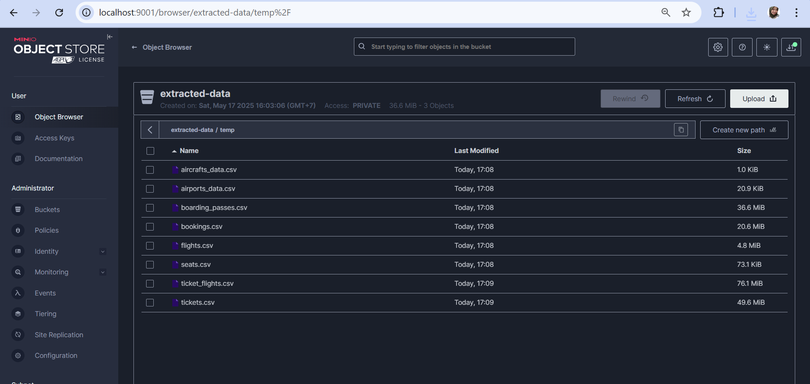
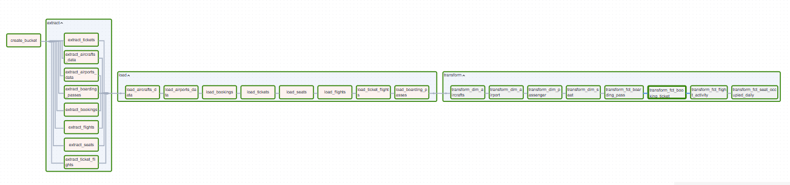
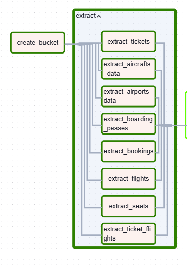
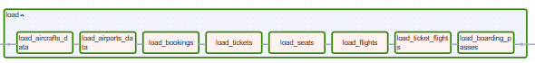
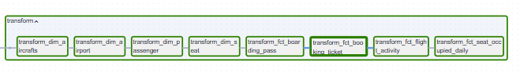
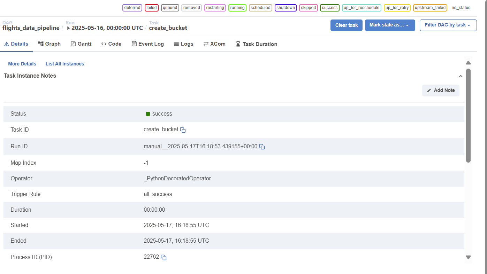
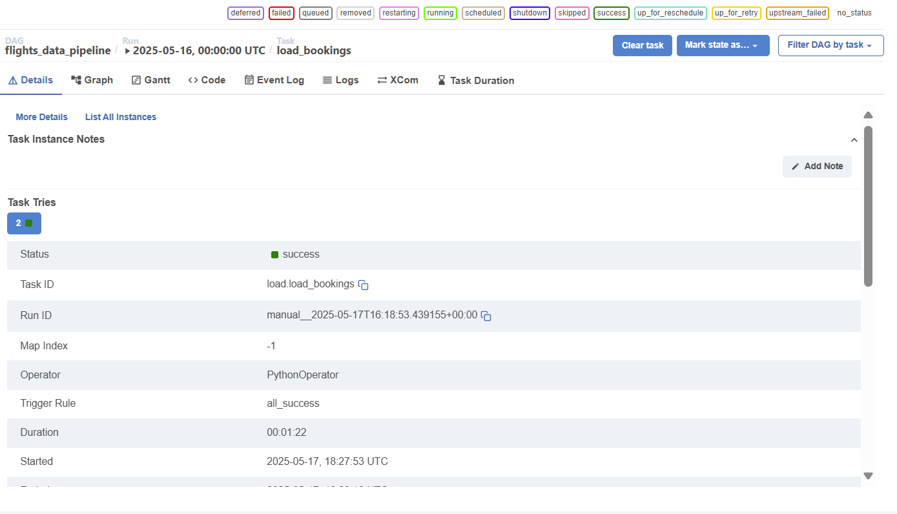
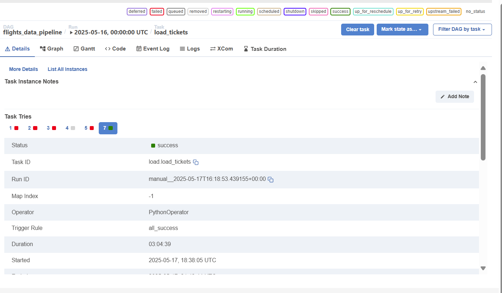
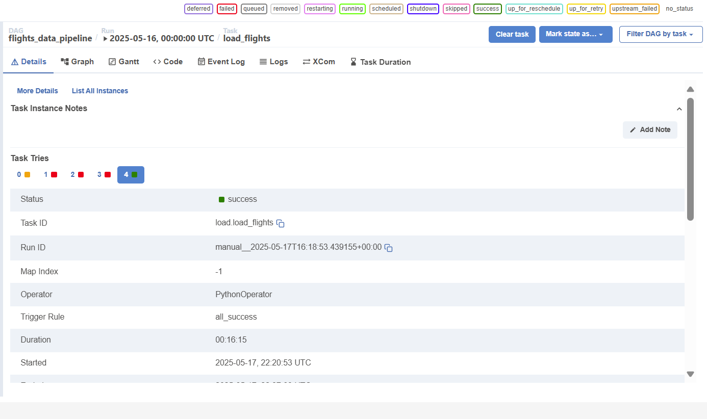

## Project Overview 

This project orchestrated an automated data pipeline that extracts data from a source database, stores it temporarily in an object store, and loads it into a data warehouse. The pipeline will be orchestrated using Apache Airflow. Apache Airflow is used for the scheduling and orchestration of data pipelines or workflows. Orchestration of data pipelines refers to the sequencing, coordination, scheduling, and managing of complex data pipelines from diverse sources. Data used in this project is from simulated flight booking system. 

## Architecture Description

- Docker: a containerization platform, used to manage and deploy data pipelines and applications. Services composed: airflow, Posgres as Data Source, Posgres as Data Warehouse and MinIO.
- Minio: MinIO as data Lake. stored data extracted from data source before processed to data warehouse.
- PosgreSQL: Data source is simulated and pre-loaded as part of the Docker setup. PostgreSQL also used as datawarehouse 
- Airflow: Apache Airflow is used for the scheduling and orchestration of data pipelines or workflows. 


## Pipeline Flow


Flow of Data Pipeline tasks that would be performed are:
- Extract: Extract data from data source (postgresSQL) and dump it to object storage (minio)
- Load: Extract data from minio object storage and upsert into a staging database (postgreSQL)
- Transform: Transforming data from staging data to datawarehouse, using SQL syntax.

  Data Pipeline is orchestrated with Airflow, using PythonOperator for Extract and Load taskgroup, and PosgresOperator for Transform taskgroup. Extract task group can be executed parallel while Load and Transform traskgroup excecuted sequentially (please check DAG picture in RUN DAG section)


## How to use this project?
1. Preparations
2. Run Docker Compose


### 1. Preparations
- **Clone repo** :
  ```
  git clone https://github.com/istywhyerlina/aiirflow-1
  ```

-  **Create env file** in project root directory  :
  ```
    AIRFLOW_FERNET_KEY=
    AIRFLOW_DB_URI=
    AIRFLOW_DB_USER=
    AIRFLOW_DB_PASSWORD=
    AIRFLOW_DB_NAME=
    AIRFLOW_WWW_USER_USERNAME=
    AIRFLOW_WWW_USER_PASSWORD=
    
    SRC_USER=
    SRC_PASSWORD=
    SRC_DB_NAME=
    
    DWH_USER=
    DWH_PASSWORD=
    DWH_DB_NAME=
    
    MINIO_ROOT_USER=
    MINIO_ROOT_PASSWORD=
  ```
 - Run fernet.py, copy the code as  AIRFLOW_FERNET_KEY in evv file
### 2. Run Docker Compose :
  ```
  docker compose up -d
  ```

  If you're already have a running service, you can run this command
  
  ```
  docker compose down --volumes && docker compose up -d
  ```
### 3. Create connection airflow to minio and postgres :
  - Get username and password
  ```
  docker logs airflow_w2 | grep username
  ```
  - Login to airflow, open in browser localhost:8081
  - Add connection to airflow >> Screenshot saved in png directory

### 4. Run DAG :

  - Dumped data to Minio
    

  - DAG Graphs
    
    
    
    


  - Example of Details Task runs
    
    
    
    
    

