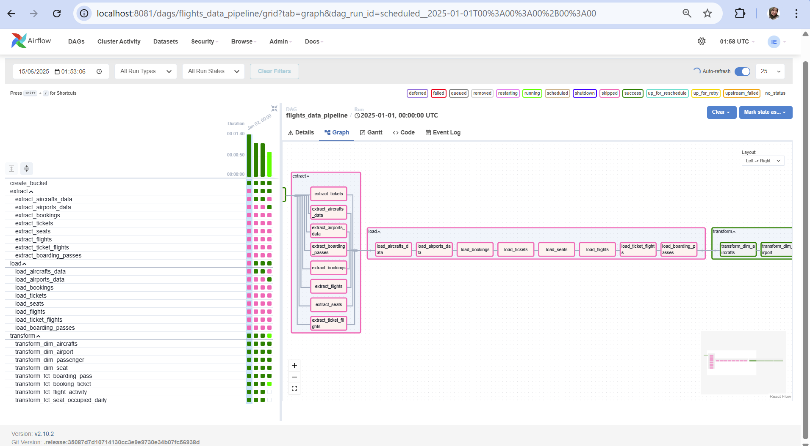

## Project Overview 

This project orchestrated an automated data pipeline that extracts data from a source database, stores it temporarily in an object store, and loads it into a data warehouse. The pipeline will be orchestrated using Apache Airflow. Apache Airflow is used for the scheduling and orchestration of data pipelines or workflows. Orchestration of data pipelines refers to the sequencing, coordination, scheduling, and managing of complex data pipelines from diverse sources. Data used in this project is from simulated flight booking system. 

This project is a continuation of the previous one, [Previously](https://github.com/istywhyerlina/aiirflow-1/tree/week-2). he modifications to be made are as follows:
- Initialize all Variables and Connections.
- Convert task declarations using Dynamic Tasks.
- Make the pipeline more flexible by implementing Incremental Mode.
- Implement Skip Exceptions.
- Set up a Slack Notifier.

# Architecture Description

- Docker: a containerization platform, used to manage and deploy data pipelines and applications. Services composed: airflow, Posgres as Data Source, Posgres as Data Warehouse and MinIO.
- Minio: MinIO as data Lake. stored data extracted from data source before processed to data warehouse.
- PosgreSQL: Data source is simulated and pre-loaded as part of the Docker setup. PostgreSQL also used as datawarehouse 
- Airflow: Apache Airflow is used for the scheduling and orchestration of data pipelines or workflows. 


## Pipeline Flow


Flow of Data Pipeline tasks that would be performed are:
- Extract: Extract data from data source (postgresSQL) and dump it to object storage (minio)
- Load: Extract data from minio object storage and upsert into a staging database (postgreSQL)
- Transform: Transforming data from staging data to datawarehouse, using SQL syntax.

  Data Pipeline is orchestrated with Airflow, using PythonOperator for Extract and Load taskgroup, and PosgresOperator for Transform taskgroup. Extract task group can be executed parallel while Load and Transform traskgroup excecuted sequentially (please check DAG picture in RUN DAG section)


## How to use this project? (preparations)


### 1. Preparations
- **Clone repo** :
  ```
  git clone https://github.com/istywhyerlina/aiirflow-1
  ```

-  **Create env file** in project root directory  :
  ```
    AIRFLOW_FERNET_KEY=
    AIRFLOW_DB_URI=
    AIRFLOW_DB_USER=
    AIRFLOW_DB_PASSWORD=
    AIRFLOW_DB_NAME=
    AIRFLOW_WWW_USER_USERNAME=
    AIRFLOW_WWW_USER_PASSWORD=
    
    SRC_USER=
    SRC_PASSWORD=
    SRC_DB_NAME=
    
    DWH_USER=
    DWH_PASSWORD=
    DWH_DB_NAME=
    
    MINIO_ROOT_USER=
    MINIO_ROOT_PASSWORD=
  ```
 - Run fernet.py, copy the code as  AIRFLOW_FERNET_KEY in evv file
### 2. Run Docker Compose :
  ```
  docker compose up -d
  ```

  If you're already have a running service, you can run this command
  
  ```
  docker compose down --volumes && docker compose up -d
  ```
## Modifications with Dynamic Task, conditional skipping, incremental and slack Notifier
### Initialize all Variables and Connections (Using CLI)

Before importing the connections, Let's export previous connection made through Web UI. Dont forget to mount a folder (in this case we use include folder) in airflow container to Local Computer
```
  docker exec -t <<airflow-container>> bash
  airflow connections export --file-format yaml --verbose <<name-file.yaml>>
```


Lets Check on the local computer


To Import Connections, connection file need to be made in yaml or json format
```
  airflow connections import  <<name-file.yaml>>
```

Lets Check on the Web UI


Variables can also be imported through CLI


### Set up a Slack Notifier

Before importing variables, we need to set up the slack-notifier with SLACK. Step by step for making slack-notifier variable:
Create workspace >> [https://api.slack.com/apps](https://api.slack.com/apps) >> create new app >> chose the workspace >> Go to Webhook menu, create from the scratch >> Copy the Webhook link to the variabe files

### Convert task declarations using Dynamic Tasks
In this part, it is required to replace all task definitions with Dynamic Tasks (Loop Based) by using variable we imported before.

### Make the pipeline more flexible by implementing Incremental Mode.
 In this part, we modify the Extract and Load processes to support daily incremental execution. Whether the process is performed incrementally or not is determined by the incremental variable previously defined.
1. If the incremental variable is set to True, the Extract and Load processes should be performed incrementally.
2. If it is set to False, the processes should perform a full extract and load of all data.

### Implement Skip Exceptions.
If the incremental value is True, every DAG Run, it is checking whether there is new data or not. If not, a task can be skipped.
## Screenshot of Task



